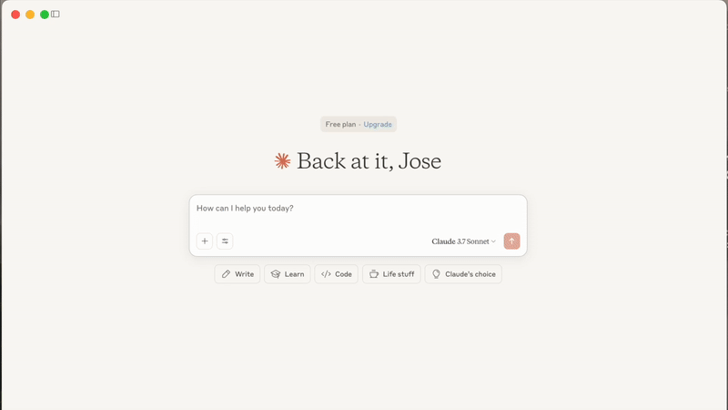

# Blackbird MCP Server 




## Prerequisites

Before you begin, ensure you have:

- [Compass API Credentials](https://docs.blackbird.ai/)
  - You will need either:
    - `BLACKBIRD_USERNAME` and `BLACKBIRD_PASSWORD`
    - `BLACKBIRD_CLIENT_KEY` and `BLACKBIRD_SECRET_KEY`
- [Claude Desktop](https://claude.ai/download) or [Cursor](https://cursor.sh)
- [uv](https://docs.astral.sh/uv/getting-started/installation/#standalone-installer)
  - You can verify your uv installation by running:
    - `uv --version`
- [Git](https://git-scm.com/downloads) installed (only needed if using Git installation method)
  - On macOS: `brew install git`
  - On Linux: 
    - Debian/Ubuntu: `sudo apt install git`
    - RedHat/CentOS: `sudo yum install git`
  - On Windows: Download [Git for Windows](https://git-scm.com/download/win)

## Blackbird MCP server installation

## Configuring the Claude Desktop app 

1. Clone the repository
```sh
git clone https://github.com/blackbirdai-team/blackbird-mcp-server.git
cd blackbird-mcp-server
```


2. Configure `claude_desktop_config.json`

### For macOS:

```bash
# Create the config file if it doesn't exist
touch "$HOME/Library/Application Support/Claude/claude_desktop_config.json"

# Opens the config file in TextEdit 
open -e "$HOME/Library/Application Support/Claude/claude_desktop_config.json"

# Alternative method using Visual Studio Code (requires VS Code to be installed)
code "$HOME/Library/Application Support/Claude/claude_desktop_config.json"
```

### For Windows:
```bash
code %APPDATA%\Claude\claude_desktop_config.json
```

### Add the Blackbird server configuration:

Replace `<PATH-TO-REPO>` with the path where you cloned the repository.
Replace the `***` with your actual Compass credentials. **Note**: you only need `BLACKBIRD_CLIENT_KEY` and `BLACKBIRD_SECRET_KEY`, or `BLACKBIRD_USERNAME` and `BLACKBIRD_PASSWORD`.

```json
{
  "mcpServers": {
    "blackbird-mcp-server": {
      "command": "uv",
      "args": [
        "run",
        "--with",
        "mcp[cli]",
        "--with",
        "backoff",
        "mcp",
        "run",
        "<PATH-TO-REPO>/blackbird-mcp-server/server.py"
      ],
      "env": {
        "BLACKBIRD_CLIENT_KEY": "***",
        "BLACKBIRD_SECRET_KEY": "***",
        "BLACKBIRD_USERNAME": "***",
        "BLACKBIRD_PASSWORD": "***"
      }
    }
  }
}
```

### Configuring Cursor

> **Note**: Requires Cursor version 0.45.6 or higher

To set up the Blckbird MCP server in Cursor:

1. Open Cursor Settings
2. Navigate to Features > MCP Servers
3. Click on the "+ Add New MCP Server" button
4. Fill out `mcp.json` the same way as you would for Claude Desktop
```json
{
  "mcpServers": {
    "blackbird-mcp-server": {
      "command": "uv",
      "args": [
        "run",
        "--with",
        "mcp[cli]",
        "--with",
        "backoff",
        "mcp",
        "run",
        "<PATH-TO-REPO>/blackbird-compass-mcp-server/server.py"
      ],
      "env": {
        "BLACKBIRD_CLIENT_KEY": "***",
        "BLACKBIRD_SECRET_KEY": "***",
        "BLACKBIRD_USERNAME": "***",
        "BLACKBIRD_PASSWORD": "***"
      }
    }
  }
}
```